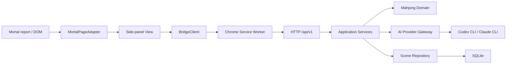
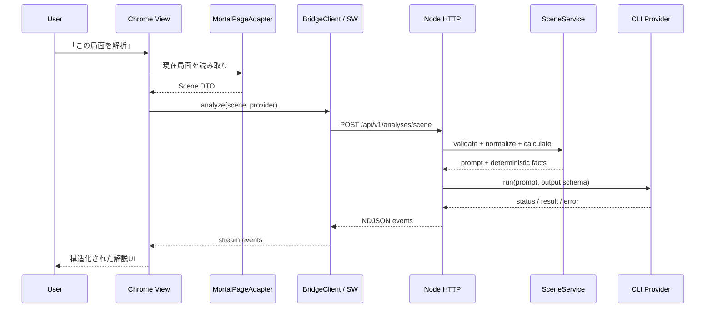
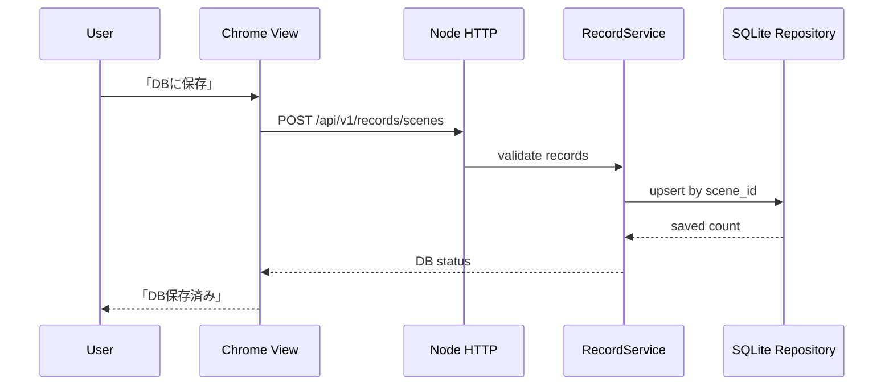

# Mortal AI Coach Architecture

## 方針

Chrome拡張をView境界、Node.jsローカルサーバーをアプリケーション境界とします。Mortal固有のDOM／JSON構造は拡張のPage Adapterで吸収し、麻雀判断・AI・保存はNode側へ閉じ込めます。



## Node.jsの依存方向

```text
bridge/server.mjs                 composition root
  ├─ bridge/http/                 HTTP controller / versioned routes
  ├─ bridge/application/          use cases and input normalization
  ├─ bridge/*.mjs                 mahjong domain calculations
  └─ bridge/infrastructure/       CLI providers and SQLite repository
```

- HTTP層はChromeやMortalのDOMを知りません。
- Application層はCLIコマンドやSQLite APIを直接呼びません。
- Infrastructure層は、Provider GatewayとRepositoryの契約を実装します。
- `server.mjs` は具象実装を組み立てるだけで、麻雀計算を持ちません。

## 局面解析シーケンス



## DB保存シーケンス

DBへはレポート閲覧時に自動保存せず、利用者が「DBに保存」を押した半荘だけ保存します。



## API互換性

- 現行契約: `1.0`
- 現行サーバー: `0.14.0`
- v1ルートは `bridge/contracts/api.mjs` が正本です。
- NDJSONイベントは `bridge/contracts/stream-event.schema.json` で定義します。
- 旧ルートはv1へ変換するだけで、新しい実装を二重に持ちません。

## 変更時のルール

1. MortalのHTMLやレポート形式への追従はPage Adapterへ置く。
2. 受け入れ・危険度・押し引き・点棒計算はNodeのDomain/Applicationへ置く。
3. AIモデル追加はProvider Gatewayの実装を増やし、ViewへCLI固有処理を書かない。
4. 保存先変更はRepository実装を差し替え、Applicationの保存ユースケースを変えない。
5. APIを破壊変更する場合は `/api/v2` を追加し、v1を同時に維持する。
